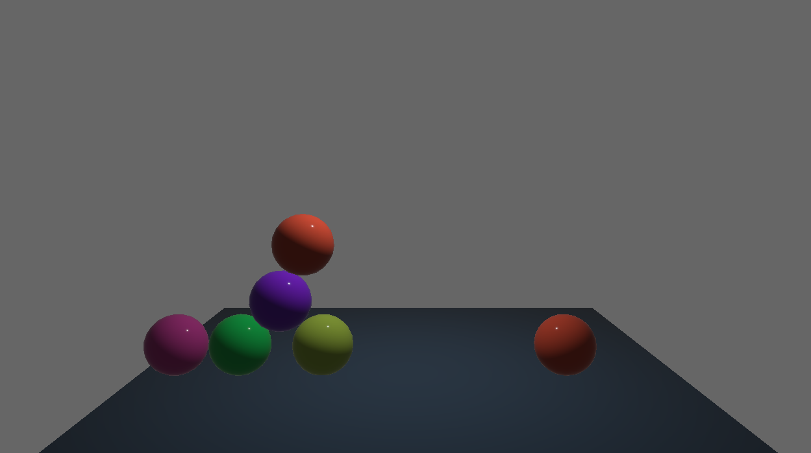

# orbgame

I'm just to learn how to use [crystalorb](https://github.com/ErnWong/crystalorb) for networked multiplayer, using the [Bevy](https://bevyengine.org/) engine.

Originally based on the example in the [`examples/demo`](https://github.com/ErnWong/crystalorb/tree/master/examples/demo) folder in the crystalorb repo, but this version is not hardcoded for three players, but instead creates a new player ball whenever a player joins.

## Building and running

You need to have [Rust](https://rustup.rs/) installed. Note that this project requires a nightly Rust build because crystalorb does, see [the rust-toolchain file](rust-toolchain).

Run the server:

    cargo run --package orbgame-server

Run a client:

    cargo run --package orbgame-client

Steer the ball with the left and right arrow keys, and jump with the up arrow.

If you have [just](https://github.com/casey/just) installed, you can also use the commands defined in [Justfile](Justfile):

    just client

and

    just server

The `just` commands also configure the logging levels, see [Justfile](Justfile).
